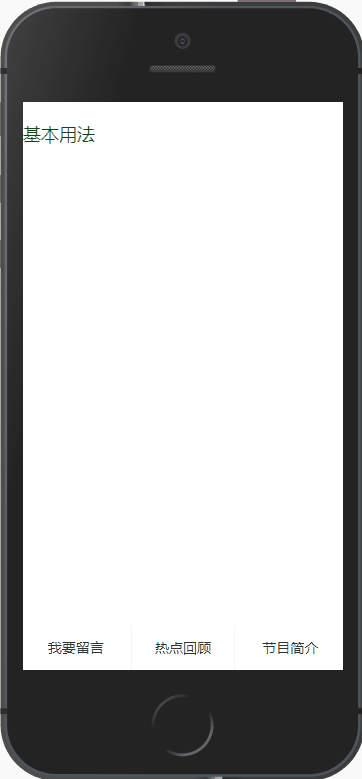

# mip-footbutton

mip-footbutton 组件说明

描述|底部按钮效果
----|----
类型|通用
支持布局| N/S
所需脚本|https://mipcache.bdstatic.com/static/v1/mip-footbutton/mip-footbutton.js

## 示例



### 基本用法
```html

  <mip-footbutton >
    <div class="btn ">我要留言</div>
    <div class="btn ">
      热点回顾
      <ul class="hot-list">
        <li><a href="javascript:;">热点1</a></li>
        <li><a href="javascript:;">热点2</a></li>
        <li><a href="javascript:;">热点3</a></li>
      </ul>
    </div>
    <div class="btn ">
      节目简介
      <ul class="hot-list">
        <li><a href="javascript:;">节目1</a></li>
        <li><a href="javascript:;">节目2</a></li>
        <li><a href="javascript:;">节目3</a></li>
      </ul>
    </div>
  </mip-footbutton>
```

## 属性

无

## 注意事项
